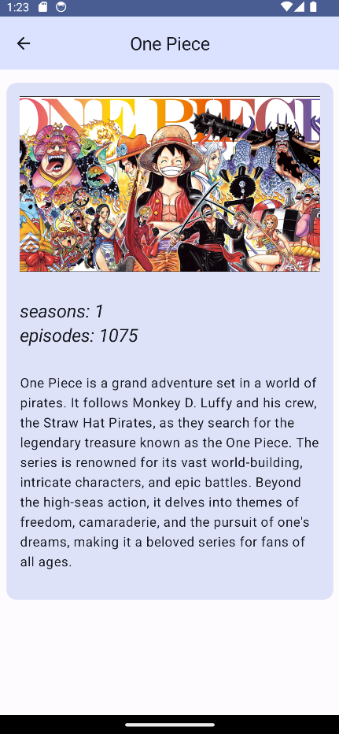
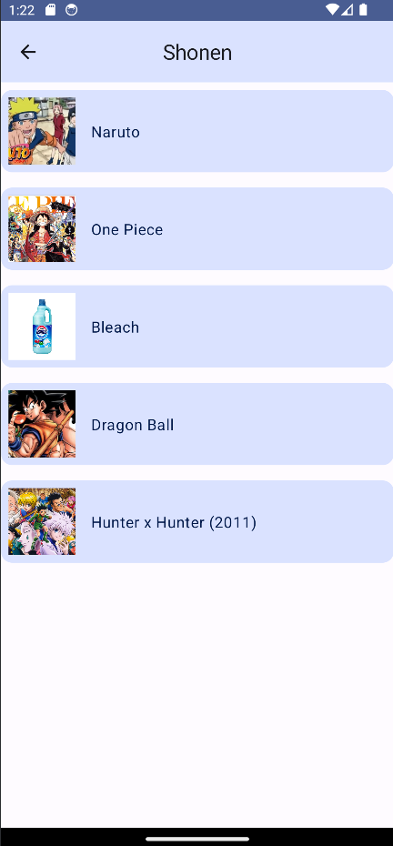
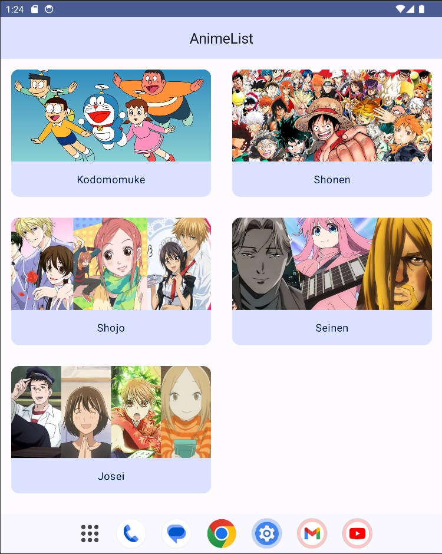
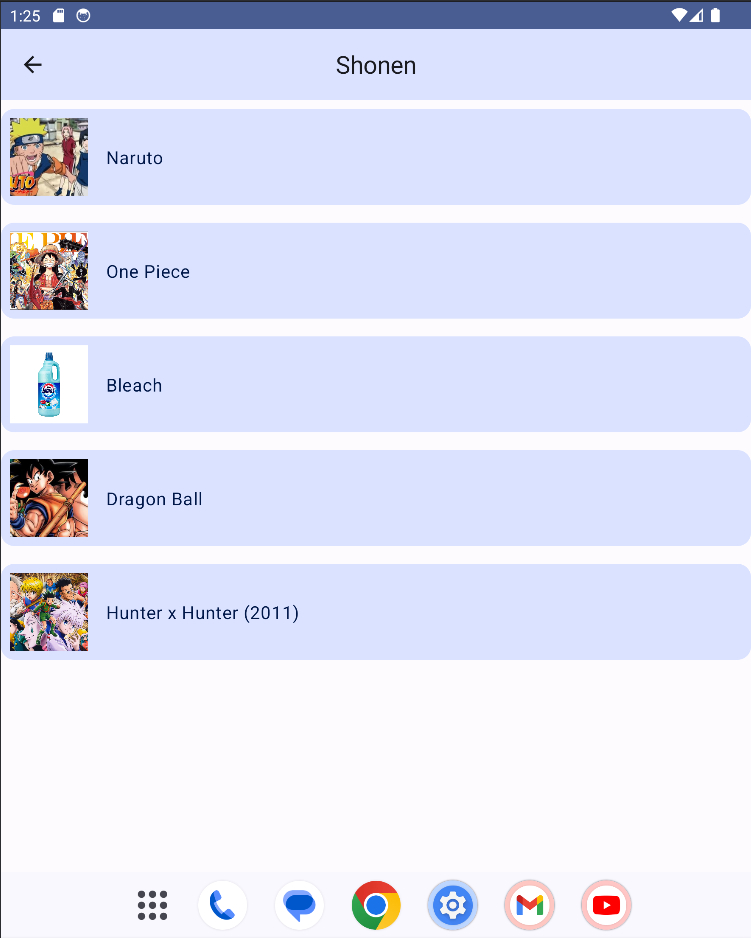
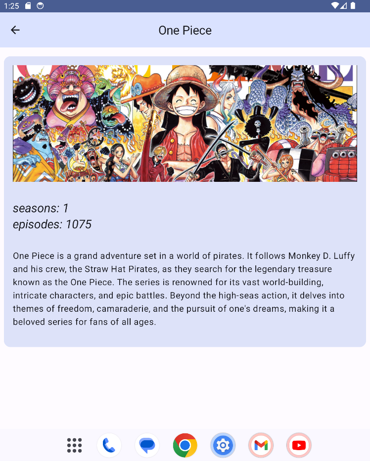
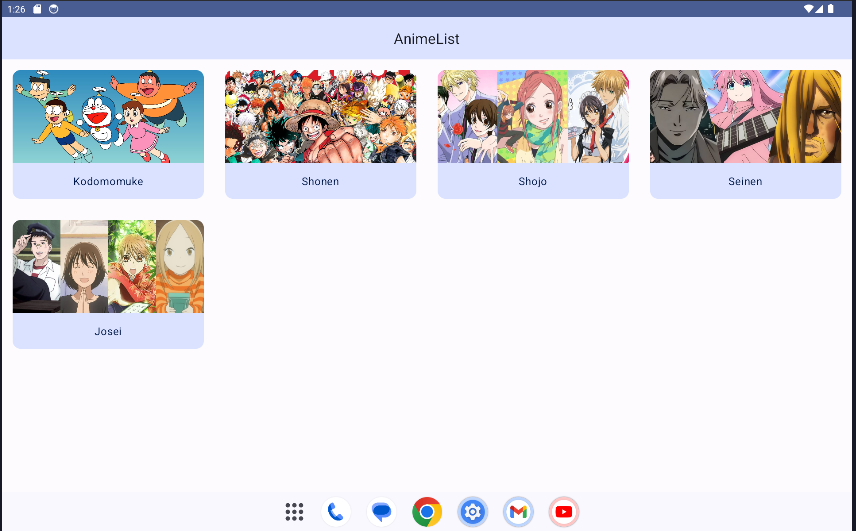
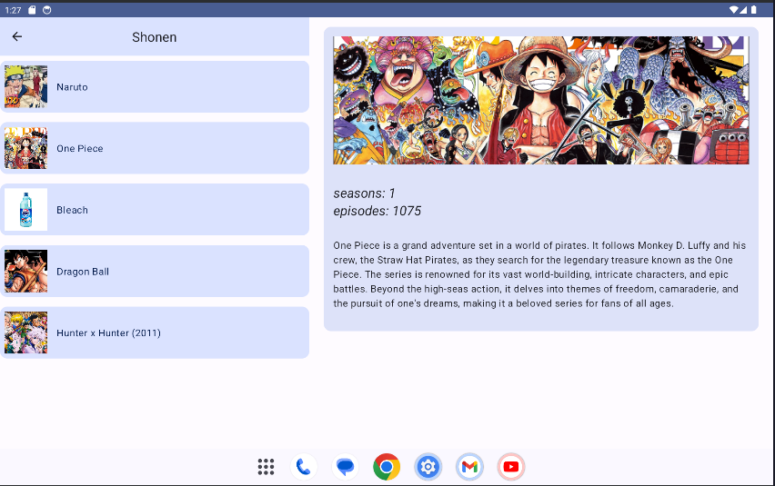
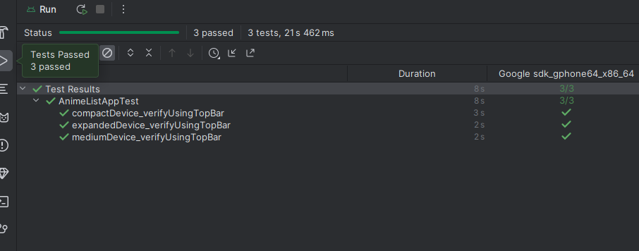

# Anime List App
Android app that displays anime info and separated by genres.
Practising with navigation and adaptivity( for compact, medium and expanded devices)

## Screenshots

    
Compact device

### Home Screen

#### Genre Screen

#### Details Screen

    
Medium device

#### Home Screen

#### Genre Screen

#### Details Screen

    
Expanded device

#### Home Screen

#### Genre and Details Screen

## Test results
